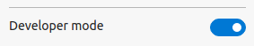

::alert
  If you haven't started Vite in the terminal, do so now
  :pm-run{script="dev"}
::

When the build completes, open Chrome or Edge and navigate to
`chrome://extensions`. Make sure to turn on the developer mode switch.

| Chrome                                                             | Edge                                                                  |
| ------------------------------------------------------------------ | --------------------------------------------------------------------- |
|  |  |
| Located in top right corner                                        | Located in left sidebar                                               |

Drag your `dist` folder into the Extensions Dashboard to install it. Your
extension icon will be in the top bar. The icon will be the first letter of the
extension's name.
